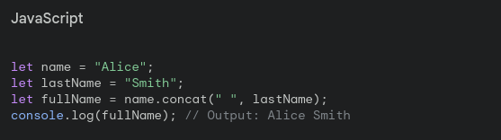

# STRING IN JS
#### WE KNOW 3 TYPES OF WRITING STRING IN JS LIKE 
`1.""`
`2.''`
`${};`
>concat();
#### 

> [!TIP]
> This method merges two or more strings together and returns a new string.


> [!TIP]
>trim()
>This method removes whitespace (spaces, tabs, newlines) from the beginning and end of a string.


> [!TIP]
>includes()
>This method checks if a string contains a specified substring. It returns true if the substring is found, and false otherwise.


> [!TIP]
>indexOf()
>This method returns the position of the first occurrence of a specified substring within a string. It returns -1 if the substring is not found.


> [!TIP]
>replace():
>This method replaces a part of a string with a new string. By default, it only replaces the first occurrence.


> [!TIP]
>replaceAll() 
>(introduced in ECMAScript 2018): This method replaces all occurrences of a substring with a new string.
#### Note: Not all browsers support this method yet.  There are ways to achieve the same functionality using regular expressions with >replace().


> [!TIP]
>repeat()
>This method creates a new string by repeating a string a specified number of times.
```bash
$ let dash = "-";
$ let line = dash.repeat(20);
$ console.log(line); // Output: ---------- (20 dashes)
```
### String extraction methods:
> [!TIP]
>slice()
>This method extracts a section of a string and returns a new string.  You can specify the starting and ending index (ending index is optional).
```bash
$ let word = "JavaScript";
$ let subString = word.slice(0, 4); // start at 0, end before 4 (which is "Java")
$ console.log(subString); // Output: Java
```
>[!TIP]
>substring():
>This method works similarly to slice(), but some browsers have subtle differences in how they handle negative values. It's generally recommended to use slice().
>[!TIP]
>split()
>This method splits a string into an array of substrings, based on a specified separator.
```bash
$ let colors = "red,green,blue";
$ let colorArray = colors.split(",");
$ console.log(colorArray); // Output: ["red", "green", "blue"]
```
#### String transformation methods:
> [!TIP]
>toString()
>This method returns the string itself.  Most of the time you wouldn't need to call this explicitly, as JavaScript treats strings as strings by default.
> [!TIP]
>toLowerCase()
>This method converts a string to lowercase letters.
```bash
$ let shout = "HELLO WORLD!";
$ let whisper = shout.toLowerCase();
$ console.log(whisper); // Output: hello world!
```
>[!TIP]
>toUpperCase()
>This method converts a string to uppercase letters.
``` bash
$ let city = "london";
$ let loudCity = city.toUpperCase();
$ console.log(loudCity); // Output: LONDON
```


### right now Numbers in Js
> [!TIP]
>Math.round(x)
>This function rounds a number x to the nearest integer. If the decimal part is exactly .5, it rounds to the nearest even number.
``` bash

    Example: Math.round(3.14) returns 3, Math.round(3.5) returns 4, Math.round(3.6) returns 4

```


>Math.ceil(x)
####  This function rounds a number x up to the nearest integer. It always rounds away from zero.
``` bash
        Example: Math.ceil(3.14) returns 4, Math.ceil(-2.5) returns -2
```

> [!TIP]
>Math.floor(x)
>This function rounds a number x down to the nearest integer. It always rounds towards zero.
``` bash
Example: Math.floor(3.14) returns 3, Math.floor(-2.5) returns -3
```

> [!TIP]
>Finding minimum and maximum:
> [!TIP]
>Math.max(x, y, ...) 
>This function takes any number of arguments and returns the largest one.
``` bash

    Example: Math.max(5, 10, 2) returns 10

```
> [!TIP]
>Math.min(x, y, ...)
>This function takes any number of arguments and returns the smallest one.
``` bash

    Example: Math.min(5, 10, 2) returns 2

```

> [!TIP]
>Calculation and random numbers:
> [!TIP]
>Math.pow(x, y)
>This function returns the base x raised to the power of y.
``` bash
Example: Math.pow(2, 3) returns 8 (2 multiplied by itself 3 times)
```
> [!TIP]
>Math.sqrt(x)
>This function returns the square root of a number x.
```bash

    Example: Math.sqrt(9) returns 3

```
> [!TIP]
>Math.abs(x)
>This function returns the absolute value of a number x. The absolute value is its distance from zero, so it's always non-negative.
``` bash

    Example: Math.abs(-5) returns 5, Math.abs(3.14) returns 3.14

```
> [!TIP]
>Math.random()
>This function generates a random number between 0 (inclusive) and 1 (exclusive). It can be useful for creating random values in your program.
``` bash 
Example: The result will be a decimal value like 0.34567    (each time you call it, you'll get a different random number)
```
`Checking numbers:`
> [!TIP]
>isNaN(x):
>This function checks if a value is Not a Number (NaN). It returns true if the argument is NaN, otherwise it returns false.
``` bash

    Example: isNaN("hello") returns true, isNaN(3.14) returns false

```


`there is a LastIndexOf "o" two it will show second the same letter it is like IndexOf but indexof will take first the same letter but lastindexof will take the 2 the same letter
and trim will gather them
toupercase to lowercase`